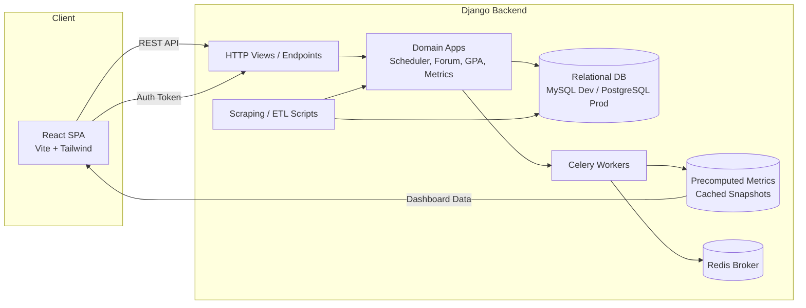

# [ugflow] (https://ugflow.com)

All-in-one academic platform for university students: conflict-free course scheduling, GPA calculation, assignment/event extraction, and a focused co‑op discussion forum.

> Built by students who experienced the pain points. Open source. Transparent.

---

## Table of Contents
- [Vision](#vision)
- [Features](#features)
- [Architecture](#architecture)
- [Tech Stack](#tech-stack)
- [Directory Structure](#directory-structure)
- [Backend Overview](#backend-overview)
- [Frontend Overview](#frontend-overview)
- [Data & Metrics](#data--metrics)
- [Local Development](#local-development)
- [Environment Variables](#environment-variables)
- [Common Workflows](#common-workflows)
- [Testing & Quality](#testing--quality)
- [Performance](#performance)
- [Security & Privacy](#security--privacy)
- [Contributing](#contributing)
- [Roadmap](#roadmap)
- [License](#license)
- [Quick Start TL;DR](#quick-start-tldr)

---

## Vision
Deliver reliable, fast academic tooling without lock‑in or hidden data practices. Every calculation and schedule generation is transparent.

---

## Features

### Academic
- Conflict-free course scheduler (term + section selection)
- Event / assignment extraction & export (iCal planned)
- GPA calculator (multiple grading schemes)
- Degree / requirement scraping utilities (internal scripts)

### Community
- Co‑op forum: posts, nested comments, voting, tagging

### Platform
- Metrics dashboard (precomputed snapshots)
- Email verification / authentication
- SEO-friendly SPA

### UX
- Accessible, responsive UI
- Motion-enhanced interactions (Framer Motion)
- Centralized auth context

---

## Architecture



Data flow:
1. Client invokes REST endpoints (auth, scheduler, forum, GPA, metrics)
2. Django domain apps handle logic and persistence
3. Celery workers aggregate + store snapshot

---

## Tech Stack

### Frontend
- React 18, Vite, React Router
- Tailwind CSS
- Framer Motion
- Recharts (dashboard)
- React Helmet Async (SEO)
- Lucide Icons
- EmailJS (contact form)

### Backend
- Django
- Custom REST-style views (no DRF dependency listed)
- Celery + Redis (async tasks)
- MySQL (dev) / PostgreSQL ready
- Precomputed metrics model

### Tooling
- Conda (environment)
- JSON fixtures
- Misc scraping scripts

---

## Directory Structure (Condensed)

```
backend/
  manage.py
  coopforum/
  scheduler/
  gpacalc/
  metrics/
    tasks.py
    models.py
  misc_scripts/
  sample.json
frontend/
  index.html
  src/
    App.jsx
    components/
    pages/
    contexts/
conda.yaml
backend_setup.md
backend_documentation.md
```

---

## Backend Overview

| Area | Purpose |
|------|---------|
| Auth | User accounts + verification |
| CoopForum | Posts, comments (nested), voting |
| Scheduler | Conflict-free timetable generation |
| GPA | Grade aggregation & prediction |
| Metrics | Periodic aggregation → cached snapshots |
| Scripts | Scraping + ingestion utilities |

Precomputation pattern:
- Task aggregates recent activity
- Stores snapshot (single row per run)
- Dashboard fetches latest snapshot only

---

## Frontend Overview

| Module / Page | Description |
|---------------|-------------|
| Home | Landing / marketing |
| About | Team, tech transparency, contact |
| Scheduler | Interactive conflict-free builder |
| GPA Calculator | Term + weighted grade modeling |
| Event Builder | Extract / manage course events |
| Co‑op Forum | Listing, detail, commenting |
| Dashboard | Usage + performance metrics |
| Privacy / Auth | Legal + verification flows |

Central auth context provides global state + guards.

---

## Data & Metrics
Collected (aggregated, non-PII focus):
- Request volume/time-series
- Latency buckets (planned)
- User activity counts (DAU/WAU/MAU)
- Feature usage distribution

Stored in `PrecomputedMetrics` for fast dashboard rendering.

---

## Local Development

### Backend

```bash
conda env create -f conda.yaml
conda activate coursescheduler  # or path shown by conda
# Create database (MySQL) manually (user/db per backend_setup.md)
python backend/manage.py migrate
python backend/manage.py loaddata backend/sample.json  # optional
python backend/manage.py runserver
```

### Frontend

```bash
cd frontend
npm install
npm run dev
```

Visit: http://localhost:5173

---

## Environment Variables

Example `.env` (backend):

```
DB_HOST=127.0.0.1
DB_USER=localdev
DB_PASSWORD=ChangeMe
DB_NAME=coursescheduler
SECRET_KEY=replace_me
REDIS_URL=redis://127.0.0.1:6379/0
EMAIL_HOST=smtp.example.com
EMAIL_USER=example
EMAIL_PASSWORD=example
```

---

## Common Workflows

| Task | Command |
|------|---------|
| Make migrations | python manage.py makemigrations |
| Apply migrations | python manage.py migrate |
| Create superuser | python manage.py createsuperuser |
| Load fixture | python manage.py loaddata sample.json |
| Dump data | python manage.py dumpdata > snapshot.json |
| Run Celery worker | celery -A backend worker -l info |
| (Planned) Beat scheduler | celery -A backend beat -l info |

Ensure Redis is running before Celery.

---

## Testing & Quality

(Placeholder until tests added)
- Target: unit tests (models, utilities)
- API integration tests
- Future: E2E (Playwright / Cypress)

Suggested command (when implemented):
```bash
pytest -q
```

---

## Performance
- Precomputed metrics avoid N heavy queries
- Lightweight SPA route-based loading
- Animation respect for reduced motion
- Future: HTTP caching headers + ETag

---

## Security & Privacy
- Minimal data retention (academic usage only)
- Email verification
- (Planned) Rate limiting + audit trail
- Dedicated privacy page

---

## Contributing

1. Fork repository
2. Create branch: feat/<name>
3. Implement change (keep scope focused)
4. Update docs if behavior changes
5. Open PR with summary + (screenshots if UI)

Checklist:
- No secrets committed
- Consistent naming conventions
- Reusable components over duplication

---

## Roadmap

| Area | Planned |
|------|---------|
| Scheduler | Batch optimization, calendar export |
| GPA | Historical term trends |
| Forum | Search + advanced filtering |
| Metrics | Anomaly detection & alert |
| Deployment | Containerization + CI |
| Accessibility | WCAG audit pass |

---

## License
MIT

---

## Quick Start TL;DR

```bash
# Backend
conda env create -f conda.yaml
conda activate coursescheduler
python backend/manage.py migrate
python backend/manage.py runserver

# Frontend
cd frontend
npm install
npm run dev
```

---

## References
- backend_setup.md
- backend_documentation.md
- metrics/tasks.py
- metrics/models.py
- frontend/src/pages/DashboardPage.jsx
- frontend/src/pages/AboutPage.jsx